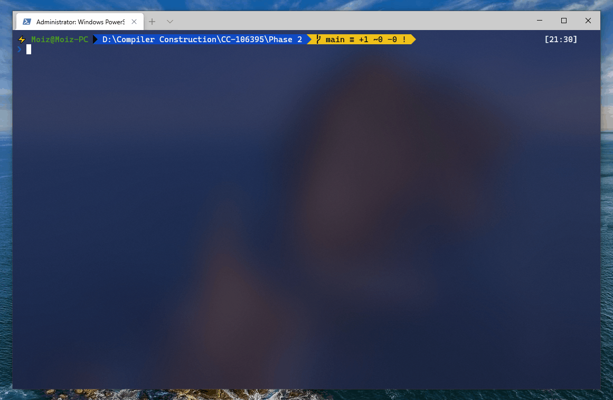

# Compiler Construction 106395 Spring 2021: Project Phase 2

## Project Members 👨 👩

|    ID     |      Name      |
| :-------: | :------------: |
| **63153** | **Abdul Moiz** |
|   63130   |   Tahoor Ali   |

# Description 🔰

A lexical analyzer for the `Mini-C` programming language using `Flex(Fast Lexical Analyzer Generator)`.

`scanner.l` file contains the token classes and lexeme patterns for `Mini-C`, download and compile the `scanner.l` file to create an executable, run the executable to scan input strings. There are two ways to provide input strings to the executable, either from the standard input in the command line or from a text file. The executable would generate a token stream in a text file.

> Refer to the [Mini-C Language Specification](https://github.com/AbdulMoizAli/CC-106395/blob/main/Phase%201/README.md) for lexical details.

# Compile (flex) 📦

compiling the `scanner.l` file would create a `lex.yy.c` file, you can provide `-o` flag to override the default output c file name.

```
>  flex scanner.l
   or
>  flex scanner.l -o <FILE NAME>
```

# Compile (gcc) 📦

Compile the c file generated by flex, that would create the main executable named `a.exe` on windows and `a.out` on linux, you can provide `-o` flag to override the default executable file name.

```
>  gcc lex.yy.c | <FILE NAME>.c
   or
>  gcc lex.yy.c -o <FILE NAME> | <FILE NAME>.c -o <FILE NAME>
```

# Run 🔁

The executable accepts zero or one argument, without any argument the program would scan input strings from the standard input in the command line, or you can specify the path to an input text file as an argument. The executable would create a text file named `TokenStream.txt` and write the token stream to it.

### Windows

```
>  a.exe | <FILE NAME>.exe
   or
>  a.exe <FILE PATH> | <FILE NAME>.exe <FILE PATH>
```

### Linux

```
$  ./a.out | ./<FILE NAME>.out
   or
$  ./a.out <FILE PATH> | ./<FILE NAME>.out <FILE PATH>
```

# Example ⬇

#### InputFile.txt

```cs
if (a == 42) {
  int b = a + 1;
  print(toString(b));
}
```

#### Execute

```
>  a.exe InputFile.txt
```

#### TokenStream.txt

```c
      <1, if>
      <12, (>
      <2, a>
      <7, ==>
      <3, 42>
      <13, )>
      <10, {>
      <1, int>
      <2, b>
      <9, =>
      <2, a>
      <6, +>
      <3, 1>
      <14, ;>
      <1, print>
      <12, (>
      <1, toString>
      <12, (>
      <2, b>
      <13, )>
      <13, )>
      <14, ;>
      <11, }>
```

# Demo 🎥


